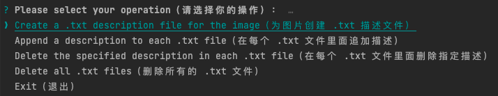

<div align="center">
  <h1>LoRA-label</h1>
</div>

<div align="center">

This project provides functions for generating and editing descriptor files for LoRA training, such as generating a `.txt` file with the same name for each image. The project template uses the [repo-temp](https://github.com/ningbonb/repo-temp) .

[](https://github.com/ningbonb/repo-temp/blob/main/LICENSE)

</div>

<div align="center">

English | [简体中文](./README.md)

</div>

## Features

- Generating a `.txt` description file with the same name for each image;
- appending identical descriptions to images in batches;
- Batch deletion of identical descriptions for images;
- Batch deletion of `.txt` files to start over;

## Usage

```bash
$ npx lora-label start
```

